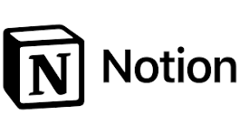

# 📅 Project Management – AI Tools

AI in Project Management helps Veeruby teams **organize tasks, capture knowledge, and improve collaboration efficiency**.  
This guide follows a consistent format: **Quick View → Details → Workflow → Cross-links.**

---

## 📌 Recommended Tools (Quick View)

| Use Case              | Tool          | Logo | Link                       | Free/Paid | Setup Time |
|------------------------|---------------|------|----------------------------|-----------|------------|
| Knowledge Base & Docs  | **Notion AI** |  | https://www.notion.so/ | ✅ Free + 💎 Paid | <5 mins (Google login) |
| Task Automation        | **ClickUp AI**|  | https://clickup.com/ | 💎 Paid | ~15 mins (workspace setup) |

---

## 🛠 Tool Details

### 1. Notion AI
- **Purpose:** Organize team docs, meeting notes, and project wikis with AI summarization.  
- **Setup:** Sign up with Google or email → create a free workspace.  
- **Free Plan:** Unlimited pages, basic AI summaries, collaboration.  
- **Paid Plan:** Advanced AI assistants, unlimited AI responses, admin controls.  
- **Internal Example:** Used by Veeruby to **document AR/VR Bootcamp agendas and volunteer tasks**.  
- ⭐ **Pro Tip:** Use `/summary` inside Notion to instantly create meeting notes from raw text.

---

### 2. ClickUp AI
- **Purpose:** End-to-end project management tool with AI for task creation, prioritization, and reports.  
- **Setup:** Requires account setup → create workspace → invite team.  
- **Free Plan:** Core task management (no AI).  
- **Paid Plan:** Adds AI assistant for task breakdown, sprint planning, and reporting.  
- **Internal Example:** Ideal for **tracking development, design, and QA tasks** in Veeruby projects.  
- ⭐ **Pro Tip:** Use “AI Task Prioritization” to automatically highlight blockers in sprint boards.  

---

## 🧭 Suggested Workflow
1. Document all agendas and notes in **Notion AI** (project wiki).  
2. Add action items into **ClickUp AI** (task boards).  
3. Use AI to generate sprint reports and project updates for stakeholders.  

👉 For **QA-related testing tasks**, see [QA Tools](../../qa/README.md) (Testim + CodiumAI).  

---

© Veeruby Technologies – *Internal Project Management Tools Reference*
