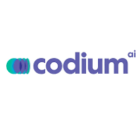

# ✅ Quality Assurance – AI Tools

AI in QA helps Veeruby teams **automate testing, generate test cases, and speed up bug detection**.  
This guide follows a consistent format: **Quick View → Details → Workflow → Cross-links.**

---

## 📌 Recommended Tools (Quick View)

| Use Case                | Tool        | Logo | Link                       | Free/Paid | Setup Time |
|--------------------------|-------------|------|----------------------------|-----------|------------|
| No-code Test Automation  | **Testim**  |  | https://www.testim.io | ✅ Free + 💎 Paid | ~10 mins (sign up & connect repo) |
| Unit/Test Generation     | **CodiumAI**|  | https://www.codium.ai/ | ✅ Free + 💎 Paid | <5 mins (install IDE plugin) |

---

## 🛠 Tool Details

### 1. Testim
- **Purpose:** Automate end-to-end testing with minimal coding using AI-driven test creation.  
- **Setup:** Sign up on [testim.io](https://www.testim.io) → create a workspace → connect project.  
- **Free Plan:** Community plan with limited tests.  
- **Paid Plan:** Advanced automation, parallel test runs, analytics.  
- **Internal Example:** Used at Veeruby to **test Unity WebGL builds for LMS platform stability**.  
- ⭐ **Pro Tip:** Record tests in Chrome once, then run them automatically across multiple browsers.

---

### 2. CodiumAI
- **Purpose:** Generates meaningful unit tests inside IDEs using static code analysis + AI.  
- **Setup:** Install CodiumAI plugin in VS Code/JetBrains → connect free account.  
- **Free Plan:** Basic AI-generated test suggestions.  
- **Paid Plan:** Unlimited test generation, enterprise features.  
- **Internal Example:** Used at Veeruby for **auto-generating test cases for LMS backend APIs**.  
- ⭐ **Pro Tip:** After generating, **review & refine tests manually** to ensure business logic coverage.

---

## 🧭 Suggested Workflow
1. Use **CodiumAI** during development → auto-generate initial unit tests.  
2. Run **Testim** for end-to-end regression testing before releases.  
3. Combine results for stronger QA coverage.  

👉 For **development integration**, see [Development Tools](../../development/README.md) (Cursor AI + GitHub Copilot).  

---

© Veeruby Technologies – *Internal QA Tools Reference*
